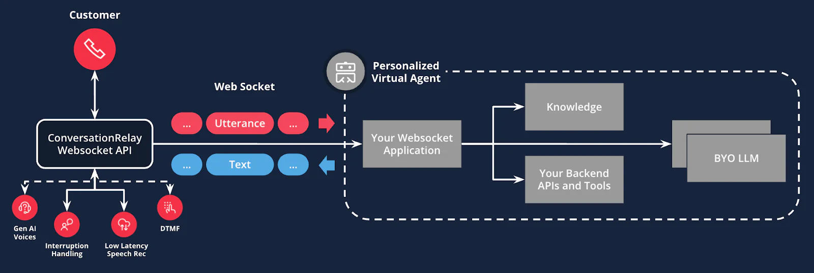

Based on Twilio Professional Services conversations-relay-sample.

# Twilio ConversationRelay

## Overview

A Twilio ConversationRelay project for building AI-powered assistants that work across **Voice** and **Messaging** channels. This template supports both real-time voice conversations via WebSocket and asynchronous messaging through Twilio Conversations (WhatsApp, SMS, etc.).



## Features

- **Voice Channel**: REST API endpoint for incoming calls with WebSocket real-time communication
- **Messaging Channel**: Twilio Conversations integration for WhatsApp and SMS
- **Multi-Provider LLM Service**: Supports OpenAI Chat Completions API, Responses API, and Agents SDK with streaming and non-streaming responses
- **Human Agent Handoff**: Seamless transfer to Twilio Flex agents for both voice and messaging
- **Typing Indicators**: WhatsApp typing indicators for improved user experience
- **Tool Integration**: Extensible tool system for custom business logic
- Jest for unit testing

## Prerequisites

- Node.js (v16+)
- npm or yarn
- Twilio Account with:
  - A phone number configured for voice and/or messaging
  - Twilio Flex (for human agent handoff)
  - Twilio Conversations Service

## Setup

### 1. Open ngrok tunnel

When developing & testing locally, you'll need to open an ngrok tunnel that forwards requests to your local development server.

```bash
ngrok http 3000
```

Copy the `Forwarding` URL (e.g., `https://[your-ngrok-domain].ngrok.app`). You will need this for environment variables and Twilio webhook configuration.

### 2. Clone and install

```bash
git clone <repository-url>
cd conversation-relay-application-template
yarn install
```

### 3. Configure environment variables

```bash
cp .env.example .env
```

Open `.env` and configure the following variables:

#### Required Variables

| Variable                          | Description                                   | Example                              |
| --------------------------------- | --------------------------------------------- | ------------------------------------ |
| `TWILIO_ACCOUNT_SID`              | Your Twilio Account SID                       | `ACXXXXXXXXXXXXXXXXXXXXXXXXXXXXXXXX` |
| `TWILIO_AUTH_TOKEN`               | Your Twilio Auth Token                        | `your_auth_token_here`               |
| `TWILIO_PHONE_NUMBER`             | Your Twilio phone number                      | `+1234567890`                        |
| `TWILIO_VOICE_INTELLIGENCE_SID`   | Voice Intelligence SID for call transcription | `GAXXXXXXXXXXXXXXXXXXXXXXXXXXXXXXXX` |
| `TWILIO_CONVERSATION_SERVICE_SID` | Conversations Service SID                     | `ISXXXXXXXXXXXXXXXXXXXXXXXXXXXXXXXX` |
| `TWILIO_WORKFLOW_SID`             | TaskRouter Workflow SID for Flex              | `WWXXXXXXXXXXXXXXXXXXXXXXXXXXXXXXXX` |
| `TWILIO_WORKSPACE_SID`            | TaskRouter Workspace SID for Flex             | `WSXXXXXXXXXXXXXXXXXXXXXXXXXXXXXXXX` |
| `OPENAI_API_KEY`                  | Your OpenAI API Key                           | `sk-...`                             |

#### Optional Variables

| Variable                       | Description                                             | Default                   |
| ------------------------------ | ------------------------------------------------------- | ------------------------- |
| `NGROK_DOMAIN`                 | Your ngrok domain (without https://)                    | -                         |
| `WELCOME_GREETING`             | Message played/sent to users on first contact           | -                         |
| `OPENAI_MAX_COMPLETION_TOKENS` | Max tokens for LLM responses (150-200 recommended)      | -                         |
| `LLM_PROVIDER`                 | LLM provider: `openai-chat-completions`, `openai-responses`, or `openai-agents` | `openai-chat-completions` |
| `LLM_MODEL`                    | OpenAI model to use (see [Model Selection Guide](docs/MODEL_SELECTION.md)) | `gpt-4.1`                 |
| `GOOGLESHEETS_SPREADSHEET_ID`  | Google Sheets ID for tools integration                  | -                         |
| `GOOGLE_CALENDAR_ID`           | Google Calendar ID for booking tools                    | -                         |
| `PORT`                         | Local server port                                       | `3000`                    |

### 4. Configure Twilio Webhooks

#### For Voice (Incoming Calls)

1. Go to **Phone Numbers > Manage > Active Numbers** in Twilio Console
2. Select your phone number
3. Under **Voice & Fax**, set:
   - **A call comes in**: Webhook
   - **URL**: `https://[your-ngrok-domain].ngrok.app/api/incoming-call`
   - **HTTP Method**: POST

#### For Messaging (Conversations)

1. Go to **Conversations > Manage > Services** in Twilio Console
2. Select your Conversations Service
3. Under **Webhooks**, add:
   - **Post-Event URL**: `https://[your-ngrok-domain].ngrok.app/api/conversations/incoming-message`
   - **Events**: `onMessageAdded`

### 5. Run the app

```bash
npm run dev
```

## Architecture

### Channel Flow

```
┌─────────────────────────────────────────────────────────────────┐
│                         Incoming Request                        │
└─────────────────────────────────────────────────────────────────┘
                                  │
                    ┌─────────────┴─────────────┐
                    ▼                           ▼
            ┌──────────────┐           ┌──────────────────┐
            │  Voice Call  │           │  Messaging/WA    │
            │  /api/       │           │  /api/           │
            │  incoming-   │           │  conversations/  │
            │  call        │           │  incoming-       │
            │              │           │  message         │
            └──────┬───────┘           └────────┬─────────┘
                   │                            │
                   ▼                            ▼
            ┌──────────────┐           ┌──────────────────┐
            │  WebSocket   │           │  Conversations   │
            │  Service     │           │  Controller      │
            └──────┬───────┘           └────────┬─────────┘
                   │                            │
                   └─────────────┬──────────────┘
                                 ▼
                        ┌──────────────┐
                        │  LLMService  │
                        │  (OpenAI)    │
                        └──────┬───────┘
                               │
                    ┌──────────┴──────────┐
                    ▼                     ▼
            ┌──────────────┐      ┌──────────────┐
            │    Tools     │      │   Human      │
            │  (Business   │      │   Agent      │
            │   Logic)     │      │   Handoff    │
            └──────────────┘      └──────────────┘
```

## Human Agent Handoff

The system supports seamless handoff to human agents via Twilio Flex for both channels.

### How It Works

1. **LLM Triggers Handoff**: The AI assistant calls the `humanAgentHandoff` tool when it determines a human agent is needed
2. **Flex Interaction Created**: A TaskRouter task is created and routed to available agents
3. **Bot Disconnects**:
   - **Voice**: The call is transferred to Flex
   - **Messaging**: Bot webhooks are removed from the conversation
4. **Agent Takes Over**: The human agent continues the conversation in Flex

### Handoff for Voice

When handoff occurs during a voice call:

- The `humanAgentHandoff` tool emits an event
- The WebSocket service sends an `end` message with handoff data
- ConversationRelay transfers the call to Flex using the configured workflow

### Handoff for Messaging

When handoff occurs during a messaging conversation ([conversationHandoff.ts](src/utils/conversationHandoff.ts)):

1. A Flex Interaction is created via the Interactions API
2. Bot webhooks are removed from the conversation (identified by `NGROK_DOMAIN`)
3. The conversation is marked as handed off in its attributes

## Typing Indicators (WhatsApp)

Typing indicators are automatically sent when processing WhatsApp messages, showing users that the bot is preparing a response. The indicator is sent by fetching the most recent inbound message from the customer via the Messaging API and triggering the typing indicator for that message.

## API Endpoints

### Voice Endpoints

| Endpoint             | Method | Description                                                |
| -------------------- | ------ | ---------------------------------------------------------- |
| `/api/incoming-call` | POST   | Process incoming voice call, initiates ConversationRelay   |
| `/api/action`        | POST   | Handle Twilio Studio connect actions (human agent handoff) |

### Messaging Endpoints

| Endpoint                                 | Method | Description                                              |
| ---------------------------------------- | ------ | -------------------------------------------------------- |
| `/api/conversations/incoming-message`    | POST   | Process incoming Conversations messages                  |
| `/api/conversations/conversation-events` | POST   | Handle conversation events (participant added/removed)   |
| `/api/conversations/message-status`      | POST   | Handle message delivery receipts                         |

## Controllers

### Voice Controllers

- **handleIncomingCall**: Processes incoming calls and initiates ConversationRelay ([callController.ts](src/controllers/callController.ts))
- **initiateRecording**: Starts call recording ([callController.ts](src/controllers/callController.ts))
- **handleConnectAction**: Handles Studio connect actions ([connectActionController.ts](src/controllers/connectActionController.ts))

### Messaging Controllers

- **handleIncomingMessage**: Processes incoming Conversations messages, manages LLM sessions, sends typing indicators ([conversationController.ts](src/controllers/conversationController.ts))
- **handleConversationEvent**: Handles conversation lifecycle events ([conversationController.ts](src/controllers/conversationController.ts))

## Services

### LLM Service

Multi-provider LLM service with factory pattern for provider selection:

- **Providers**: OpenAI Chat Completions API (`openai-chat-completions`), Responses API (`openai-responses`), and Agents SDK (`openai-agents`)
- **Factory**: [factory.ts](src/services/llm/factory.ts) - Creates the appropriate service based on `LLM_PROVIDER` config
- **Chat Completions**: [openai-chat-completions.ts](src/services/llm/providers/openai-chat-completions.ts) - Stable, well-tested API
- **Responses API**: [openai-responses.ts](src/services/llm/providers/openai-responses.ts) - Uses `instructions` parameter for efficient system prompt handling
- **Agents SDK**: [openai-agents.ts](src/services/llm/providers/openai-agents.ts) - Built-in agent loop with automatic tool execution (advanced)

All providers support:
- Streaming (voice) and non-streaming (messaging) responses
- Tool calls and function execution
- Events for handoff, conversation end, and completion
- Configurable model via `LLM_MODEL` environment variable

See [Model Selection Guide](docs/MODEL_SELECTION.md) for detailed provider and model recommendations.

### WebSocket Service

Real-time communication for voice calls ([websocketService.ts](src/services/llm/websocketService.ts))

## Tools

The LLM can use various tools for business logic:

| Tool                       | Description                     |
| -------------------------- | ------------------------------- |
| `humanAgentHandoff`        | Transfers to a human agent      |
| `switchLanguage`           | Changes conversation language   |
| `identifyUser`             | Looks up user in spreadsheet    |
| `bookDriver`               | Books a driver using calendar   |
| `addSurveyResponse`        | Stores survey answers           |
| `checkCardDelivery`        | Checks card delivery status     |
| `checkIncreaseLimit`       | Checks credit limit eligibility |
| `checkPendingBill`         | Checks for pending bills        |
| `checkHsaAccount`          | Checks HSA account status       |
| `checkPaymentOptions`      | Gets available payment options  |
| `troubleshootLoginIssues`  | Helps resolve login issues      |
| `searchCommonMedicalTerms` | Searches medical terms          |

See [src/services/llm/tools/](src/services/llm/tools/) for implementations.

## Scripts

| Script          | Description                              |
| --------------- | ---------------------------------------- |
| `npm run dev`   | Start development server with hot reload |
| `npm run build` | Compile TypeScript to JavaScript         |
| `npm start`     | Run production build                     |
| `npm test`      | Run unit tests                           |

## Project Structure

```
src/
├── config.ts                 # Environment configuration
├── server.ts                 # Express + WebSocket server
├── controllers/
│   ├── callController.ts           # Voice call handling
│   ├── connectActionController.ts  # Studio actions
│   └── conversationController.ts   # Messaging handling + typing indicators
├── routes/
│   ├── callRoutes.ts               # Voice endpoints
│   ├── connectActionRoutes.ts      # Action endpoints
│   └── conversationRoutes.ts       # Messaging endpoints
├── services/llm/
│   ├── factory.ts                  # LLM provider factory
│   ├── types.ts                    # LLM type definitions
│   ├── websocketService.ts         # Voice WebSocket
│   ├── providers/
│   │   ├── openai-chat-completions.ts  # Chat Completions API
│   │   ├── openai-responses.ts         # Responses API
│   │   └── openai-agents.ts            # Agents SDK (advanced)
│   └── tools/                      # LLM tools
│       ├── toolDefinitions.ts      # Tool definitions (auto-generated from Zod)
│       ├── *.ts                    # Individual tools with Zod schemas
│       └── converter.ts            # Tool format converter
├── utils/
│   └── conversationHandoff.ts      # Flex handoff logic
├── types/
│   └── index.ts                    # TypeScript types
└── data/
    └── mock-data.ts                # Mock data for tools
```

## License

This project is licensed under the MIT License.
